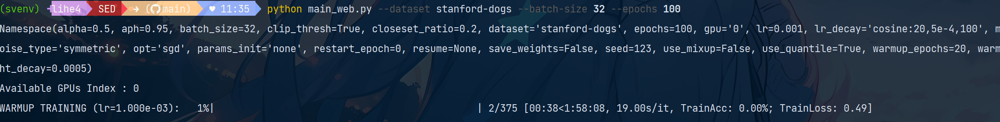

# SED项目复现学习实录

**学习目标**：复现项目代码，能够运行项目，项目中的数据集能替换成其他的数据集（分类任务）。

**仓库链接**：https://github.com/NUST-Machine-Intelligence-Laboratory/SED

**项目介绍**：Label noise is ubiquitous in real-world scenarios, posing a practical challenge to supervised models due to its effect in hurting the generalization performance of deep neural networks. Existing methods primarily employ the sample selection paradigm and usually rely on dataset-dependent prior knowledge (e.g., a pre-defined threshold) to cope with label noise, inevitably degrading the adaptivity. Moreover, existing methods tend to neglect the class balance in selecting samples, leading to biased model performance. To this end, we propose a simple yet effective approach named SED to deal with label noise in a Self-adaptivE and class-balanceD manner. Specifically, we first design a novel sample selection strategy to empower self-adaptivity and class balance when identifying clean and noisy data. A mean-teacher model is then employed to correct labels of noisy samples. Subsequently, we propose a self-adaptive and class-balanced sample re-weighting mechanism to assign different weights to detected noisy samples. Finally, we additionally employ consistency regularization on selected clean samples to improve model generalization performance. Extensive experimental results on synthetic and real-world datasets demonstrate the effectiveness and superiority of our proposed method.

标签噪声在现实场景中无处不在，它对监督模型提出了实际挑战，因为它会损害深度神经网络的泛化性能。现有方法主要采用样本选择范式，通常依赖于依赖于数据集的先验知识（例如，预定义的阈值）来应对标签噪声，这不可避免地降低了模型的自适应性。此外，现有方法在选择样本时往往忽略了类别平衡，导致模型性能出现偏差。为此，我们提出了一种简单有效的方法 SED，以自适应和类别平衡的方式处理标签噪声。具体而言，我们首先设计了一种新颖的样本选择策略，以增强在识别干净数据和噪声数据时的自适应性和类别平衡性。然后，我们采用均值教师模型来校正噪声样本的标签。随后，我们提出了一种自适应且类别平衡的样本重新加权机制，为检测到的噪声样本分配不同的权重。最后，我们进一步对选定的干净样本进行一致性正则化，以提高模型的泛化性能。在合成和真实数据集上进行的大量实验结果证明了我们提出的方法的有效性和优越性。


## 项目结构

```
SED/
├── Figure.png                   # 方法框架图，展示SED方法的整体流程
├── README.md                    # 项目说明文档，包括摘要、安装、数据集、训练命令和实验结果
├── Table1.png                   # CIFAR100N和CIFAR80N上的实验结果表
├── Table2.png                   # Web系列数据集（Web-Aircraft、Web-Bird、Web-Car）的实验结果表
├── Table3.png                   # CIFAR100N上不同组件对模型性能影响的分析表
├── main.py                      # 主要训练入口（适用于CIFAR100N、CIFAR80N等数据集），包含训练流程、模型构建、优化器设置等
├── main_web.py                  # Web系列数据集的训练入口，逻辑与main.py类似，针对Web数据集做适配
├── requirements.txt             # 项目依赖库列表，包含PyTorch、TorchVision等
├── run.sh                       # 训练脚本示例，包含不同数据集的训练命令
├── util.py                      # 通用工具函数，如权重初始化等
├── model/
│   ├── MLPHeader.py             # MLP头定义，用于构建模型的分类头或投影头
│   ├── ResNet32.py              # ResNet32模型的基础模块（BasicBlock）定义
│   └── SevenCNN.py              # 七层CNN模型定义，适用于CIFAR等小型数据集
├── utils/
│   ├── NoisyUtils.py            # 处理带噪声标签的工具函数
│   ├── QaQ.py                   # QaQ相关实现（可能与样本选择或噪声处理有关）
│   ├── SCR.py                   # 自适应性类别平衡样本重加权机制（SCR）的实现
│   ├── SCS.py                   # 自适应样本选择策略（SCS）的实现，用于区分干净样本和噪声样本
│   ├── __init__.py              # 包初始化文件
│   ├── builder.py               # 构建工具，如数据加载器、优化器等的构建函数
│   ├── core.py                  # 核心功能模块（具体功能需结合代码细节）
│   ├── ema.py                   # 均值教师模型（EMA）的实现，用于标签校正
│   ├── eval.py                  # 评估相关函数，如计算准确率等指标
│   ├── logger.py                # 日志记录工具
│   ├── loss.py                  # 损失函数定义
│   ├── mask.py                  # 掩码相关操作（可能用于样本筛选）
│   ├── mask_figure.py           # 与掩码相关的可视化或计算（如SAT机制在FreeMatch中的实现）
│   ├── mask_loss.py             # 基于掩码的损失函数
│   ├── meter.py                 # 指标计量工具，如计算平均损失、准确率等
│   ├── module.py                # 通用模块定义
│   ├── plotter.py               # 实验结果可视化工具，绘制训练损失、准确率等曲线
│   ├── qaq_v2.py                # QaQ方法的第二个版本实现
│   └── utils.py                 # 其他辅助工具函数
└── data/
    ├── Clothing1M.py            # Clothing1M数据集的加载和处理逻辑
    ├── __init__.py              # 包初始化文件
    ├── image_folder.py          # 基于图像文件夹的通用数据集加载器
    ├── imbalance_cifar.py       # 不平衡CIFAR数据集的处理逻辑
    └── noisy_cifar.py           # 带噪声的CIFAR数据集（如CIFAR100N、CIFAR80N）的加载和处理逻辑
```

### readme文件提到的可用数据集介绍

####  合成噪声数据集

基于 CIFAR100 构建，用于模拟不同噪声场景：

- **CIFAR100N**：闭集噪声数据集。所有噪声标签仍属于原始 CIFAR100 的 100 个类别，仅存在类别混淆的噪声（如对称噪声、非对称噪声）。
- **CIFAR80N**：开集噪声数据集。将 CIFAR100 的后 20 个类别视为分布外（out-of-distribution）类别，噪声标签可能来自这 20 个开集类别或其他闭集类别，更接近真实复杂场景。

#### 真实世界数据集

包含真实噪声标签的实际场景数据集：

- **Clothing1M**：包含 100 万张服装图片，标签存在自然噪声，类别数为 14 类，常用于验证模型在真实噪声下的性能。
- **Web 系列数据集**：

  - **Web-Aircraft**：基于网页图片构建的飞机类别数据集，存在真实噪声标签。
  - **Web-Car**：基于网页图片构建的汽车类别数据集，含真实标签噪声。
  - **Web-Bird**：基于网页图片构建的鸟类类别数据集，包含真实真实世界中的标签噪声。

这些数据集支持不同噪声类型（对称噪声、非对称噪声）和噪声比率配置，覆盖了合成噪声和真实噪声场景，用于全面验证 SED 方法在带噪声标签学习任务中的有效性。

‍

---

## 开始

### **1.克隆代码到本地。** （ C:\Users\lihe4\Documents\GitHub\SED）

```c++
git clone https://github.com/NUST-Machine-Intelligence-Laboratory/SED.git
```

接下来用pycharm打开克隆的仓库

### **2.创建虚拟环境**

注意使用的python解释器版本应为3.8或者3.9，如果没有请到官方网站下载

```c++
# 根据自己的python.exe路径来创建虚拟环境，如我的路径为"C:\Users\lihe4\AppData\Local\Programs\Python\Python38\python.exe"

C:\Users\lihe4\AppData\Local\Programs\Python\Python38\python.exe -m venv svenv

# 激活虚拟环境

svenv\Scripts\activate
```

由于本项目的requirments.txt文件还带有关于conda的绝对路径，并且默认GPU，而我使用的是venv且我的电脑无GPU只能采用CPU环境训练，故改为如下文件

```c++
absl-py==1.3.0
addict==2.4.0
aiohttp==3.8.3
aiosignal==1.3.1
asciitree==0.3.3
astor==0.8.1
async-timeout==4.0.2
asynctest==0.13.0
attrs==22.1.0
cachetools==5.2.0
certifi==2022.12.7
cffi==1.15.1
charset-normalizer==2.1.1
cloudpickle==2.2.1
colorama==0.4.6
comet-ml==3.32.5
configobj==5.0.8
contextlib2==21.6.0
cycler==0.11.0
dill==0.3.5.1
dulwich==0.21.3
easydict==1.9
entrypoints==0.4
everett==3.1.0
fasteners==0.18
filelock==3.8.0
fonttools==4.37.3
frozenlist==1.3.3
fsspec==2022.11.0
gitdb==4.0.9
GitPython==3.1.26
glib==1.0.0
google-auth==2.12.0
google-auth-oauthlib==0.4.6
got==0.0.1
grpcio==1.49.1
higher==0.2.1
huggingface-hub==0.10.1
idna==3.4
importlib-metadata==5.0.0
importlib-resources==5.12.0
JIT==0.0.1
joblib==1.2.0
json-tricks==3.16.1
jsonpatch==1.32
jsonpointer==2.3
jsonschema==4.17.3
kiwisolver==1.4.4
kornia==0.6.7
llvmlite==0.39.1
Markdown==3.4.1
MarkupSafe==2.1.1
matplotlib==3.5.3
multidict==6.0.2
multiprocess==0.70.13
networkx==2.6.3
nni==2.10
numba==0.56.3
numcodecs==0.10.2
numpy==1.21.6
oauthlib==3.2.1
opencv-python==4.6.0.66
packaging==21.3
pandas==1.3.5
Pillow==9.2.0
pkgconfig==1.5.5
pkgutil_resolve_name==1.3.10
prettytable==3.6.0
protobuf==3.19.6
psutil==5.9.4
pyarrow==10.0.0
pyasn1==0.4.8
pyasn1-modules==0.2.8
pycparser==2.21
pyparsing==3.0.9
pyrsistent==0.19.3
python-box==6.1.0
python-dateutil==2.8.2
PythonWebHDFS==0.2.3
pytz==2022.2.1

PyYAML==6.0
randaugment==1.0.2
requests==2.28.1
requests-oauthlib==1.3.1
requests-toolbelt==0.10.1
responses==0.18.0
rsa==4.9
schema==0.7.5
scikit-learn==1.0.2
scipy==1.7.3
semantic-version==2.10.0
sentry-sdk==1.18.0
setproctitle==1.3.2
shapely==2.0.1
simplejson==3.18.3
six==1.16.0
smmap==5.0.0
tensorboard==2.11.2
tensorboard-data-server==0.6.1
tensorboard-logger==0.1.0
tensorboard-plugin-wit==1.8.1
tensorboardX==2.5.1
threadpoolctl==3.1.0
tifffile==2021.11.2
timm==0.6.13
torch==1.12.0
torchnet==0.0.4
torchvision==0.13.0
tornado==6.2
tqdm==4.64.1
typeguard==2.13.3
typing_extensions==4.3.0
urllib3==1.26.12
visdom==0.2.3
wcwidth==0.2.6
websocket-client==1.3.3
websockets==10.4
Werkzeug==2.2.2
wrapt==1.15.0
wurlitzer==3.0.3
xxhash==3.1.0
yarl==1.8.1
zarr==2.12.0
zipp==3.9.0
pyvips
```

然后执行

```c++
pip install -r requirements.txt -i https://pypi.tuna.tsinghua.edu.cn/simple
## 走镜像源安装依赖
```

注意安装pyvips时可能会卡住，可先把pyvips从re文件里删去执行安装命令，完事再单独执行pip install pyvips安装，但是注意

虽然装了 `pyvips`​，但是它只是 **Python 的绑定**，核心的 **libvips C 库**（`libvips-42.dll`​）没有装，所以你如果用到相关函数会报错。

在 Windows 下，`pyvips`​ 不会自动带 `libvips`​，需要手动安装。可以进入https://github.com/libvips/build-win64-mxe/releases?page=2，下载8.14.x版本的libvips,然后讲bin目录添加到系统环境变量的path里就可以了。

```c++
踩的坑：下载过程中卡住/报错可尝试将代理改成规则/全局，关闭代理，换镜像源等措施。同时最好保证你的电脑有C 编译环境（VS Build Tools）
```

### 3 **.准备数据集开始训练**

该项目提供了几组可供训练的不同数据集，并配有相应的的数据处理逻辑，我们这里以训练CIFAR-100数据集为例（换成别的也差不多）。

下载数据集：[CIFAR-10 / CIFAR-100数据集（官网/网盘下载）_cifar100pytorch下载-CSDN博客](https://blog.csdn.net/qq_43280818/article/details/104405544)

**确认数据集存放路径**

根据代码逻辑（如 `SED/data/imbalance_cifar.py`​ 和 `SED/utils/builder.py`​），数据集需要放在在项目指定目录：

- 将下载好的 `cifar-100-python.tar.gz`​ 复制到 `SED/data/cifar100/`​ 目录下（**无需解压**，代码会自动处理）。

‍

当然，可以直接修改utils/builder.py 文件中的 build_cifar100n_dataset 函数，将数据的 download 参数从 False 改为 True，这样会自动联网下载。

‍

**再次强调，由于我没有GPU,只得采用CPU方式进行训练，但原项目代码逻辑是显式采用GPU,我修改了关于device逻辑的相关代码，显式将本项目改写成了CPU版本，更改的代码部分很少，也就几十行，有CPU版本的我上传的代码仓库可参考https://github.com/foorgange 。**

‍

**运行基础实验（CIFAR-100N 示例）**

CIFAR-100N 是基于 CIFAR-100 生成的带噪声数据集，代码会自动从原始数据生成噪声标签。

**CPU 适配的运行命令**：

```c++
python main.py --warmup-epoch 5 --epoch 20 --batch-size 16 --lr 0.01 --warmup-lr 0.01 --noise-type symmetric --closeset-ratio 0.2 --lr-decay cosine:5,5e-4,20 --opt sgd --dataset cifar100nc --gpu -1
```

```bash
带注释含义解释：

python main.py \
  --warmup-epoch 5 \       # 缩短热身轮次，减少计算量
  --epoch 20 \             # 总训练轮次（CPU 运行较慢，先跑少量轮次）
  --batch-size 16 \        # 减小批次大小，避免内存溢出
  --lr 0.01 \              # 学习率适当降低
  --warmup-lr 0.01 \
  --noise-type symmetric \ # 噪声类型：对称噪声（可选 asymmetric 非对称）
  --closeset-ratio 0.2 \   # 噪声比例：20%
  --lr-decay cosine:5,5e-4,20 \  # 学习率衰减策略适配少轮次
  --opt sgd \              # 优化器
  --dataset cifar100nc     # 指定数据集为 CIFAR-100N
```

**观察运行结果**

- **首次运行**：代码会自动读取 `cifar-100-python.tar.gz`​，解压并处理数据，生成带噪声的 CIFAR-100N 数据集（无需手动干预）。
- **运行过程**：终端会输出每轮训练的精度（如 `train_acc`​）、损失（如 `loss`​）等信息，可确认是否正常训练。


如图即进行正常训练。

当然你也可以采用main_web.py训练。区别就是

```c++
图像处理设置方面：
main_web.py 额外导入了 PIL.ImageFile 并设置 ImageFile.LOAD_TRUNCATED_IMAGES = True，用于处理可能被截断的图像文件，适合网络图像数据集（如 web-* 系列）
main_web.py 加入了警告过滤 warnings.filterwarnings('ignore')，减少训练过程中的警告输出
损失函数设置方面：
在 warmup 函数中，main_web.py 的交叉熵损失加入了标签平滑（label_smoothing=0.3），而 main.py 未使用标签平滑
在 robust_train 函数中，main_web.py 的清洁样本损失（loss_clean）和自监督损失（loss_SSL）均使用了标签平滑（label_smoothing=0.3），main.py 未使用
默认参数差异方面：
alpha 参数默认值：main.py 为 1.0，main_web.py 为 0.5
momentum_scr 参数默认值：main.py 为 0.999，main_web.py 为 0.99
数据处理适配方面：
main_web.py 更适合处理 web-* 系列数据集（如 web-aircraft、web-bird、web-car），通过标签平滑和截断图像处理适配网络图像的噪声特性
main.py 更适合处理 cifar100nc 等常规噪声数据集
```

  
​

### 若要更换采用数据集

使用cifar80no数据集（带有开放集噪声的CIFAR-80） ：

```
python main.py --warmup-epoch 5 --epoch 20 --batch-size 16 --lr 0.01 --warmup-lr 0.01 --noise-type symmetric --closeset-ratio 0.2 --lr-decay cosine:5,5e-4,20 --opt sgd --dataset cifar80no --gpu -1
```


若要采用`web-bird`​数据集

```c++
python main_web.py --warmup-epoch 5 --epoch 20 --batch-size 16 --lr 0.01 --warmup-lr 0.01 --noise-type symmetric --closeset-ratio 0.2 --lr-decay cosine:5,5e-4,20 --opt sgd --dataset web-bird --gpu -1
```

```c++
数据集说明

Web-Bird 数据集

请从 [weblyFG-dataset](https://github.com/NUST-Machine-Intelligence-Laboratory/weblyFG-dataset) 下载 Web-Bird 数据集，并将其解压到 `Datasets/web-bird` 目录下，确保目录结构如下：

Datasets/
└── web-bird/
    ├── train/
    │   ├── class_1/
    │   │   ├── image1.jpg
    │   │   ├── image2.jpg
    │   │   └── ...
    │   ├── class_2/
    │   └── ...
    └── val/
        ├── class_1/
        │   ├── image1.jpg
        │   ├── image2.jpg
        │   └── ...
        ├── class_2/
        └── ...

 Web-Aircraft 和 Web-Car 数据集

同样，请从 [weblyFG-dataset](https://github.com/NUST-Machine-Intelligence-Laboratory/weblyFG-dataset) 下载 Web-Aircraft 和 Web-Car 数据集，并将它们分别解压到 `Datasets/web-aircraft` 和 `Datasets/web-car` 目录下，确保目录结构与 Web-Bird 类似。

```

对于win电脑，只需要复制数据集链接到浏览器地址栏，直接下载：https://web-fgvc-496-5089-sh.oss-cn-shanghai.aliyuncs.com/web-bird.tar.gz即可。


下载完解压到项目内。

执行命令即采用resnet模型进行训练（main.py 主要用于使用 CNN 模型训练，而 main_web.py 主要用于使用 ResNet50 模型训练）


‍

---

同时除了现有数据集，还可以添加其他数据集，只需要：

1. ‍

    创建新的数据集加载函数，类似于 build_webfg_dataset 或 build_food101n_dataset
2. ‍

    在 main_web.py 的 build_loader 函数中添加对新数据集的支持
3. 3. ‍

    确保数据集遵循正确的目录结构（通常是train/val子目录）  
    对于图像分类数据集，最简单的方法是按照Web系列数据集的格式组织你的数据：

```
Datasets/
└── your-dataset-name/
    ├── train/
    │   ├── class_1/
    │   │   ├── image1.jpg
    │   │   └── ...
    │   ├── class_2/
    │   └── ...
    └── val/
        ├── class_1/
        │   ├── image1.jpg
        │   └── ...
        ├── class_2/
        └── ...
```

然后修改 main_web.py 文件中的 build_loader 函数，添加对你的数据集的支持。参考现有的Web系列数据集的处理方式。

#### 实践：

这里我选取经典的Stanford Dogs数据集，这是一个包含120个狗品种的图像分类数据集。

在data目录下创建一个新文件stanford_dogs.py

```python
import os
import torch
import torchvision
import numpy as np
from torch.utils.data import Dataset
from PIL import Image
from data.image_folder import IndexedImageFolder

def build_stanford_dogs_dataset(root, train_transform, test_transform):
    """
    构建Stanford Dogs数据集
    
    参数:
        root: 数据集根目录，应包含train和val子目录
        train_transform: 训练数据的转换
        test_transform: 测试数据的转换
    
    返回:
        包含训练和测试数据集的字典
    """
    train_data = IndexedImageFolder(os.path.join(root, 'train'), transform=train_transform)
    test_data = IndexedImageFolder(os.path.join(root, 'val'), transform=test_transform)
    return {'train': train_data, 'test': test_data, 'n_train_samples': len(train_data.samples), 'n_test_samples': len(test_data.samples)}


def build_dummy_stanford_dogs_dataset(root, train_transform, test_transform):
    """
    构建虚拟的Stanford Dogs数据集，用于测试代码
    
    参数:
        root: 数据集根目录
        train_transform: 训练数据的转换
        test_transform: 测试数据的转换
    
    返回:
        包含训练和测试数据集的字典
    """
    from data.dummy_dataset import DummyWebDataset
    
    # Stanford Dogs有120个类别
    num_classes = 120
    
    train_data = DummyWebDataset(os.path.join(root, 'train'), 
                                transform=train_transform, 
                                num_classes=num_classes, 
                                samples_per_class=20)
    
    test_data = DummyWebDataset(os.path.join(root, 'val'), 
                               transform=test_transform, 
                               num_classes=num_classes, 
                               samples_per_class=5)
    
    return {'train': train_data, 'test': test_data, 
            'n_train_samples': len(train_data.samples), 
            'n_test_samples': len(test_data.samples)}
```

修改main_web.py的build_loader函数，添加对Stanford Dogs数据集的支持。

```python
else:
            # 使用实际数据集
            dataset = build_webfg_dataset(dataset_path,
                                      CLDataTransform(transform['train'], transform["train_strong_aug"]),
                                      transform['test'])
        trainloader = DataLoader(dataset["train"], batch_size=params.batch_size, shuffle=True, num_workers=0,
                                 pin_memory=True)
        test_loader = DataLoader(dataset['test'], batch_size=16, shuffle=False, num_workers=0,
                                 pin_memory=False)
    
    elif dataset_n == 'stanford-dogs':
        num_classes = 120  # Stanford Dogs有120个狗品种类别
        transform = build_transform(rescale_size=448, crop_size=448)
        
        # 检查数据集路径是否存在
        dataset_path = os.path.join('Datasets', dataset_n)
        train_path = os.path.join(dataset_path, 'train')
        val_path = os.path.join(dataset_path, 'val')
        
        # 检查是否使用虚拟数据集
        use_dummy = False
        if not os.path.exists(dataset_path) or not os.path.exists(train_path) or not os.path.exists(val_path):
            print(f"警告: 数据集路径 '{dataset_path}' 或其子目录不存在!")
            print(f"您可以从 http://vision.stanford.edu/aditya86/ImageNetDogs/ 下载 Stanford Dogs 数据集")
            print(f"并将其放置在 '{dataset_path}' 目录下，确保有 'train' 和 'val' 子目录")
            print("\n正在使用虚拟数据集进行测试...")
            use_dummy = True
        
        if use_dummy:
            # 使用虚拟数据集
            dataset = build_dummy_stanford_dogs_dataset(dataset_path,
                                                   CLDataTransform(transform['train'], transform["train_strong_aug"]),
                                                   transform['test'])
        else:
            # 使用实际数据集
            dataset = build_stanford_dogs_dataset(dataset_path,
                                              CLDataTransform(transform['train'], transform["train_strong_aug"]),
                                              transform['test'])
        trainloader = DataLoader(dataset["train"], batch_size=params.batch_size, shuffle=True, num_workers=0,
                                 pin_memory=True)
        test_loader = DataLoader(dataset['test'], batch_size=16, shuffle=False, num_workers=0,
                                 pin_memory=False)

```

创建一个简单的下载脚本，自动下载和处理Stanford Dogs数据集。

```python
import os
import requests
import tarfile
import shutil
from tqdm import tqdm
from scipy.io import loadmat

# 创建必要的目录
os.makedirs('Datasets/stanford-dogs/train', exist_ok=True)
os.makedirs('Datasets/stanford-dogs/val', exist_ok=True)
os.makedirs('downloads', exist_ok=True)

# 下载数据集文件
files_to_download = [
    ('http://vision.stanford.edu/aditya86/ImageNetDogs/images.tar', 'downloads/images.tar'),
    ('http://vision.stanford.edu/aditya86/ImageNetDogs/annotation.tar', 'downloads/annotation.tar'),
    ('http://vision.stanford.edu/aditya86/ImageNetDogs/lists.tar', 'downloads/lists.tar')
]

for url, path in files_to_download:
    if not os.path.exists(path):
        print(f'下载 {url} 到 {path}')
        response = requests.get(url, stream=True)
        total_size = int(response.headers.get('content-length', 0))
        
        with open(path, 'wb') as file, tqdm(desc=path, total=total_size, unit='B', unit_scale=True) as bar:
            for data in response.iter_content(chunk_size=1024):
                file.write(data)
                bar.update(len(data))
    else:
        print(f'{path} 已存在，跳过下载')

# 解压文件
for _, path in files_to_download:
    extract_dir = 'downloads'
    print(f'解压 {path} 到 {extract_dir}')
    with tarfile.open(path) as tar:
        tar.extractall(path=extract_dir)

# 处理数据集
print('处理数据集...')

# 加载训练集和测试集列表
train_data = loadmat('downloads/train_list.mat')
test_data = loadmat('downloads/test_list.mat')

# 获取文件列表
train_files = [f[0][0] for f in train_data['file_list']]
test_files = [f[0][0] for f in test_data['file_list']]

# 处理训练集
print('处理训练集...')
for file_path in tqdm(train_files):
    # 获取类别名称（文件夹名）
    class_name = os.path.dirname(file_path)
    # 创建类别目录
    class_dir = os.path.join('Datasets/stanford-dogs/train', class_name)
    os.makedirs(class_dir, exist_ok=True)
    
    # 复制图像
    src_path = os.path.join('downloads/Images', file_path)
    dst_path = os.path.join('Datasets/stanford-dogs/train', file_path)
    shutil.copy(src_path, dst_path)

# 处理测试集
print('处理测试集...')
for file_path in tqdm(test_files):
    # 获取类别名称（文件夹名）
    class_name = os.path.dirname(file_path)
    # 创建类别目录
    class_dir = os.path.join('Datasets/stanford-dogs/val', class_name)
    os.makedirs(class_dir, exist_ok=True)
    
    # 复制图像
    src_path = os.path.join('downloads/Images', file_path)
    dst_path = os.path.join('Datasets/stanford-dogs/val', file_path)
    shutil.copy(src_path, dst_path)

print('数据集准备完成！')
print('您现在可以使用以下命令训练模型：')
print('python main_web.py --dataset stanford-dogs --batch-size 32 --epochs 100')
```

同时不要忘了对190+行的代码作出如下修改

```python
def build_model(num_classes, params_init, dev, config):
    if config.dataset.startswith('web-') or config.dataset == 'stanford-dogs':
        net = ResNet(arch="resnet50", num_classes=num_classes, pretrained=True)
    else:
        net = CNN(input_channel=3, n_outputs=n_classes)

    return net.to(dev)

## 因为原本只是web开头的用resnet模型，但是我们的stanford-dogs也是要用resnet模型的，故做如上修改
```

执行脚本处理数据集

```python
python download_stanford_dogs.py
```

执行训练

```python
python main_web.py --dataset stanford-dogs --batch-size 32 --epochs 100
```



如此，我们就完成了对数据集的更换训练。

### 另外要讲

我一开始的方案是采用谷歌的colab来白嫖GPU资源来训练


不过折腾了一会子才发现colab确实挺好用，但是一个笔记本（一个环境）预装了python和常用的一些库，而这些库的版本和re文件的或有冲突，当然可以以re文件为准重新安装，不过我嫌麻烦，还是在本机采用了修改的cpu版本，不过对于其它依赖较新的项目，colab将是及其简单聪明的选择。

---

‍
